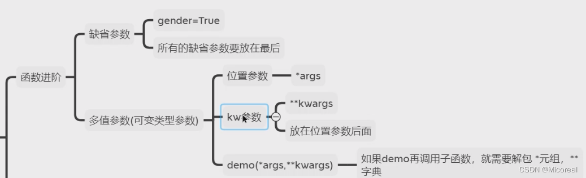

@[TOC]
见我的另一个专栏，有专门介绍python

[链接](https://blog.csdn.net/micoreal/category_12130085.html)

# 变量
[链接](https://blog.csdn.net/Micoreal/article/details/128353914)

==关于多行注释的补充，在函数的前方def functionname：的下面可以写上三对引号的多行注释，这个有利于我们可以使用鼠标移动到使用这个函数的位置，可以直接查看这个函数的基本功能==

# 判断
[链接](https://blog.csdn.net/Micoreal/article/details/128378650)

三个关键字（不知道当时为啥没写。。。。）
|逻辑判断  |解释  |
|--|--|
|and  |与  |
|or|或|
|not|非|

而且实际上对于此处的优先级来说和C不像，他们的优先级都比判断的优先级低。

# 循环
[链接](https://blog.csdn.net/Micoreal/article/details/128390176)

补充for-else语法（一般用于判断这个元素在不在容器当中，如果在容器当中做什么，不在容器当中做什么）

代码解释：

```python
for i in range(10):
	if i == 5:
		print('i == ' + i)
		break;
else:
	print('don\'t find')
```

# 函数
[链接](https://blog.csdn.net/Micoreal/article/details/128402273)

# 容器
[链接](https://blog.csdn.net/Micoreal/article/details/128407784)

补充：
==对于字典来说，他的迭代遍历实际上遍历的是key==
由于方法很多，这里稍微总结一下，具体的可以去帖子中查找：

## 列表

|函数|	功能|
|-|-|
|列表.append(元素)|	尾部追加一个元素|
|列表.extend(列表)|	尾部追加一个列表（多个元素）|
|列表.insert(下标，元素)|	在指定下标的地方，插入指定的元素|
|del 列表[下标]|	删除指定下标的元素|
|列表.pop(下标)|	删除指定下标的元素（返回值为该元素）|
|列表.remove(元素)|	删除指定内容的元素（第一个）|
|列表.clear()|	清空列表|
|列表.count(元素)|	统计这个元素在列表中出现的次数|
|列表.index(元素)|	查询该元素出现的下标（第一个）|
|len(列表)|	返回列表当中元素的数量|

## 元组
|函数|	功能|
|-|-|
|元组.index(元素)|	查询该元素出现的下标（第一个）|
|元组.count(元素)|	统计这个元素在列表中出现的次数|
|len(元组)|	返回元组当中元素的数量|

## 字符串
|函数|	功能|
|-|-|
|字符串[下标]|	根据索引取出特定位置的字符|
|字符串.replace(字符串1，字符串2)|	将字符串内的全部字符串1替换为字符串2|
|字符串.split(字符串)|	按照给定的字符串，对字符串进行分割，不会修改原本的字符串，而是得到一个新的列表，作为分隔符的字符串不会出现在列表里|
|字符串.split(element)|	如果element没有内容代表取出首尾的空格，如果有内容代表取出首尾出现的相关的字符|
|字符串.count(字符子串)|	统计这个字符子串在字符串中出现的次数|
|字符串.index(字符串)|	查询该字符串出现的下标（第一个）|
|len(字符串)|	返回字符串当中字符的数量|

## set
|函数|	功能|
|-|-|
|集合.add(元素)|	集合内添加一个元素|
|集合.pop()|	随机取出集合的一个元素（返回值为该元素）|
|集合.remove(元素)|	删除指定内容的元素|
|集合.clear()|	清空集合|
|len(集合)|	返回集合当中元素的数量|
|集合1.difference(集合2)|	得到一个新集合，内部是集合1与集合2的差值|
|集合1.difference_updata(集合2)|	在集合1中，删除集合2的元素，集合2保持不变|
|集合1.union(集合2)|	得到一个新的集合，内含集合1和集合2的所有元素|

## 字典
|操作|	说明|
|-|-|
|字典[key]|	获取指定key对应的value|
|字典[key]=value|	添加或者更新键值对|
|字典.pop(key)|	从字典中取出key对应的value值|
|字典.clear()|	清空字典|
|字典.keys()|	获取字典中全部的key，可用于for循环遍历字典，但是for循环也可以直接接上字典名字，相当于也是直接取key|
|len(字典)|	计算字典中的元素的数量|

# 函数进阶
[链接](https://blog.csdn.net/Micoreal/article/details/128438692)

补充：解包操作
*p 元组  **p字典

```python
def demo1(*args,**kwargs):
    print(args)
    print(kwargs)

# 可变参数 也叫 多值参数
# 在元组前加*就是解包(unpack),效果呢就是 (1,2,3,4) 就会变为1,2,3,4
# 在字典前加** 就是解包(unpack), 效果呢{'name': '小明', 'age': 18, 'gender': True}
# 变为name="小明", age=18, gender=True
def demo(num,*args,**kwargs):
    print(num)
    print(args)
    print(kwargs)
    print('-'*50)
    demo1(*args,**kwargs) # 重点关注这一句

demo(1, 2, 3, 4, 5, name="小明", age=18, gender=True)
```





# 补充
## 在linux下运行py文件
首先先了解什么是shebang
### shebang
Shebang
释伴 :到底用什么解释器来执行下面的代码

==在不进行修改shebang的时候，linux下默认调用的是/bin/bash 也就是shell的解释器 而如果我们想要使用python写脚本，实际上可以先which操作，探究python解释器在哪里，然后添加shebang进行操作。==

更具体的解释见：
[链接](https://blog.csdn.net/u012294618/article/details/78427864)

### 使用pycharm与linux进行相交互
第一步：
![[image/f0e04c2604684167d4cd06b102ace044_MD5.png]]
需要先将文件的格式转化为LF 实际上就是转化为linux可以认知的模式，原因就是window下的CRLF的换行是/r/n是存在两个字符的，所以实际上九四不兼容的，我们就需要进行先修改这里，成为LF格式。

第二步：
去对应的linux下寻找你python解释器的位置，使用这条指令进行查找
![[image/c33a185151af3e2ae7496e76787bdf92_MD5.png]]
返回的位置记住。
![[image/f6e573e26edbd813ebc31f73a929ddef_MD5.png]]
第三步：
在pycharm中的文件上加入#! shebang以及相对应的地址
![[image/9133c4d98481511ffe67850f817333bc_MD5.png]]

这边建议可以在设置中加上模板，方便以后的操作：
![[image/a2bab1ebee28c35471816089363f40d7_MD5.png]]

建议加上：

```bash
#!/usr/bin/python
# author lgt
# ${YEAR}年${MONTH}月${DAY}日
```

第四步：
使用scp将该文件传到linux下，并使用==chmod +x 文件名 ==就可以执行了。

![[image/ba5c0907b3e7331c4193d95a8b54cad0_MD5.png]]


